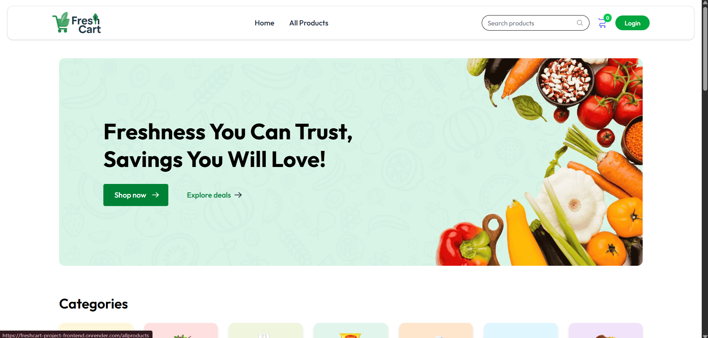
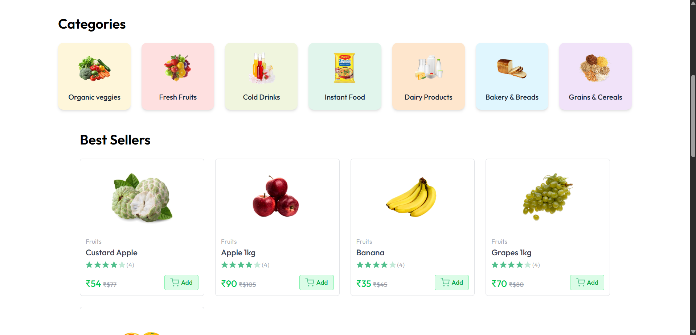
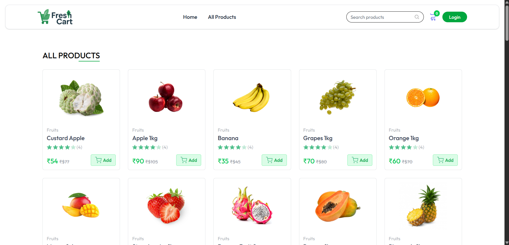
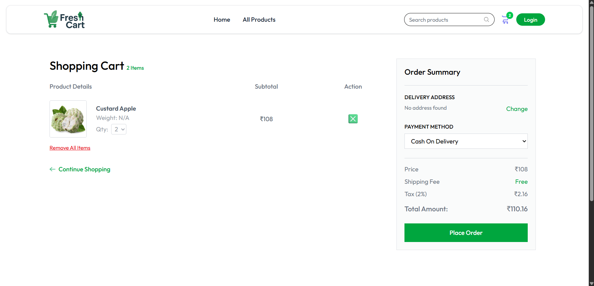
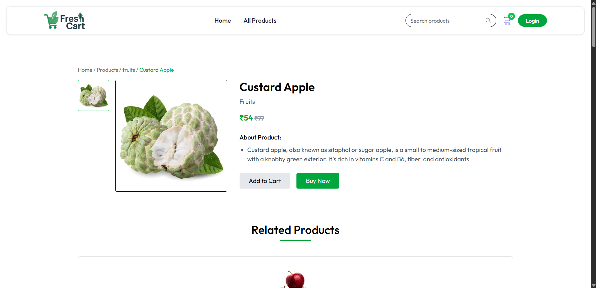
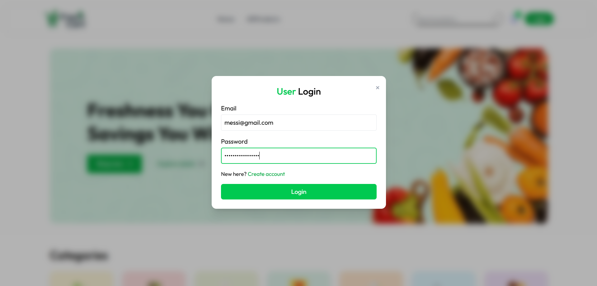
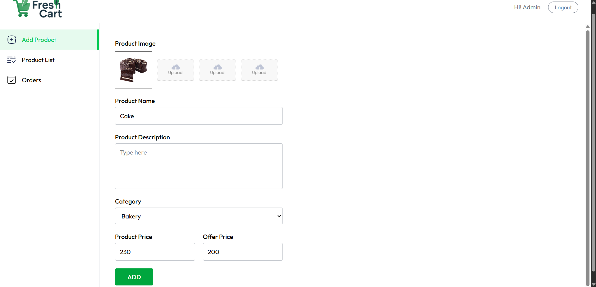

# 🛒 FreshCart – Full Stack MERN E-Commerce Platform

FreshCart is a full-stack e-commerce web application built using the MERN stack. It provides a seamless shopping experience for customers along with a dedicated seller dashboard for managing products, inventory, and orders.

🌐 **Live Demo:** https://freshcart-project-frontend.onrender.com

---

## 📸 Screenshots

### 🏠 Home Page

---
### 📦 Categories

---
### 🛍 Products

---

### 🛒 Shopping Cart

---

### 🛒 Product Info

---

### 🔐 User Login

---

### 👨‍💼 Seller Dashboard

---

### ➕ Add Product

---

## ✨ Features

### 👤 User Features
- User Registration & Login (JWT Authentication)
- Browse Products
- Search Products
- Filter Products by Category
- Add to Cart
- Update Cart Quantity
- Remove Individual Items
- Clear Entire Cart
- Save Delivery Address
- Place Orders
- Stripe Payment Integration
- Persistent Cart using Local Storage
- Responsive UI

### 🛍 Seller Dashboard
- Secure Seller Login
- Add Products with Multiple Images
- Upload Images using Cloudinary
- Manage Product Inventory
- View Product List
- View Customer Orders

---

## 🛠 Tech Stack

### Frontend
- React.js
- React Router DOM
- Axios
- Tailwind CSS
- React Toastify

### Backend
- Node.js
- Express.js
- MongoDB Atlas
- Mongoose
- JWT Authentication
- Cookie Parser
- Multer
- Cloudinary
- Stripe

### Deployment
- Frontend: Render
- Backend: Render
- Database: MongoDB Atlas

---

## 📂 Project Structure

FreshCart
│
├── client
│   ├── components
│   ├── pages
│   ├── context
│   ├── assets
│   └── App.jsx
│
├── server
│   ├── configs
│   ├── controllers
│   ├── middleware
│   ├── models
│   ├── routes
│   └── server.js
│
└── README.md

---

## 🚀 Installation

### Clone the Repository

git clone https://github.com/yugsgithub/FreshCart.git
cd FreshCart

### Install Dependencies

Frontend

cd client
npm install

Backend

cd ../server
npm install

---

## ▶️ Run the Application

Backend

npm run server

Frontend

npm run dev

---

## 🔐 Environment Variables

Create a `.env` file inside the `server` directory and configure the required environment variables:

PORT=
MONGODB_URI=
JWT_SECRET=
SELLER_EMAIL=
SELLER_PASSWORD=
CLOUDINARY_CLOUD_NAME=
CLOUDINARY_API_KEY=
CLOUDINARY_API_SECRET=
STRIPE_SECRET_KEY=
STRIPE_WEBHOOK_SECRET=

Create a `.env` file inside the `client` directory:

VITE_BACKEND_URL=http://localhost:4000

---

## 📸 Screenshots

> Add screenshots of:
- Home Page
- Product Page
- Cart
- Login
- Seller Dashboard
- Add Product
- Orders Page

---

## 📌 Future Improvements

- Wishlist
- Product Reviews & Ratings
- Email Notifications
- Coupon System
- Order Tracking
- Admin Analytics Dashboard
- Dark Mode

---

## 🤝 Contributing

Contributions are welcome!

Feel free to fork this repository and submit a pull request.

---

## 📄 License

This project is licensed under the MIT License.

---

## 👨‍💻 Author

**Yug Panchal**

If you found this project useful, consider giving it a ⭐ on GitHub.
